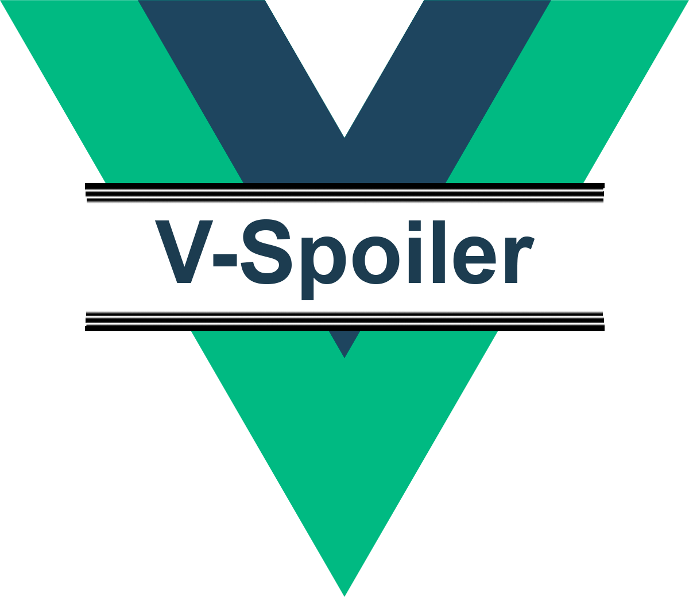

# v-spoiler



Vue Spoiler is simple component for showing and hiding content. It could be useful for build accordions, or to hiding long agreements.

Component based on slot body height and give possibility to trigger toggling content visibility by your way.
## Development
```
npm install
npm run serve
```

### Compiles and minifies for demo production
```
npm run build
```

### Compiles and minifies lib for production
```
npm run build:lib
```

### Lints and fixes files
```
npm run lint
```
